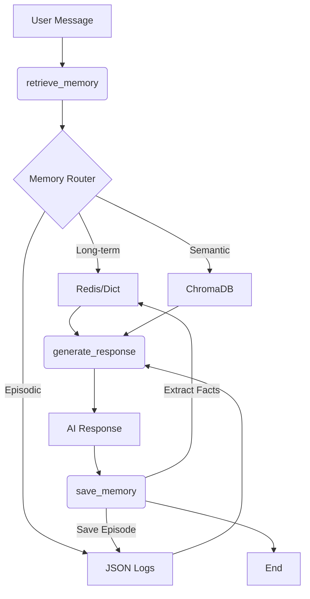

# Multi-Memory Agent with LangGraph

Hệ thống Agent thông minh tích hợp bộ nhớ 4 tầng phân cấp (Short-term, Long-term, Episodic, Semantic) sử dụng LangGraph.

## 1. Kiến trúc hệ thống

Hệ thống sử dụng LangGraph để quản lý luồng dữ liệu và tương tác với các tầng bộ nhớ:

### Các tầng bộ nhớ:
1.  **Short-term (Working Memory)**: Lưu trữ hội thoại gần đây, quản lý bằng sliding window và token trimming.
2.  **Long-term (Declarative Memory)**: Lưu trữ Profile (Facts/Prefs) của user. Hỗ trợ Redis và fallback Local Dict.
3.  **Episodic Memory**: Lưu trữ nhật ký trải nghiệm (Task/Trajectory/Outcome/Reflection) dưới dạng JSON.
4.  **Semantic Memory**: Lưu trữ kiến thức chuyên môn (Domain Knowledge) sử dụng ChromaDB Vector Store.

## 2. Các tính năng nổi bật
- **Memory Router**: Tự động phân loại ý định người dùng để truy xuất đúng tầng bộ nhớ cần thiết.
- **Conflict Resolution**: Áp dụng chính sách "Recency wins" khi cập nhật thông tin mâu thuẫn.
- **Token Budgeting**: Phân bổ tài nguyên ngữ cảnh hợp lý cho từng loại bộ nhớ.
- **Privacy-by-Design**: Hỗ trợ TTL cho dữ liệu và tính năng "Right to be Forgotten" (xóa toàn bộ dữ liệu user).

## 3. Cấu trúc dự án
- `architecture.py`: Định nghĩa các lớp quản lý bộ nhớ.
- `agent.py`: LangGraph workflow và logic xử lý chính.
- `benchmark.py`: Script đánh giá hiệu năng 10 kịch bản.
- `config.py`: Cấu hình hệ thống và API.
- `prompts/`: Chứa các template prompt cho LLM.

## 4. Benchmark kết quả
Xem chi tiết tại [BENCHMARK.md](./BENCHMARK.md).

## 5. Phản biện & Bảo mật
Xem chi tiết tại [REFLECTION.md](./REFLECTION.md).
